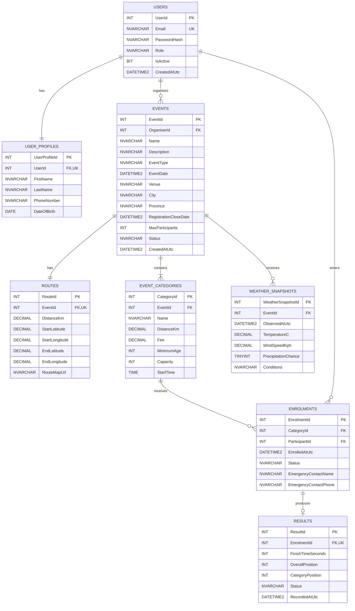

# RaceDay Entity Relationship Diagram

## Relationship Summary

- One user has one user profile.
- One organiser can create many events.
- One participant can have many enrolments.
- One event has one route.
- One event contains one or more categories.
- One event can have multiple weather snapshots.
- One category can receive many enrolments.
- One enrolment can have zero or one result.